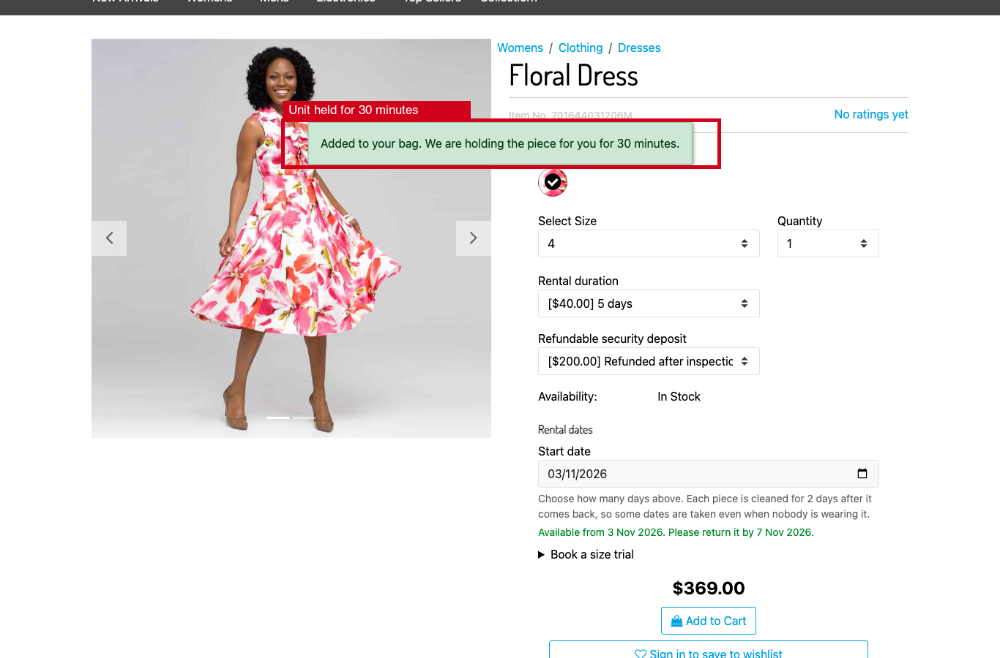
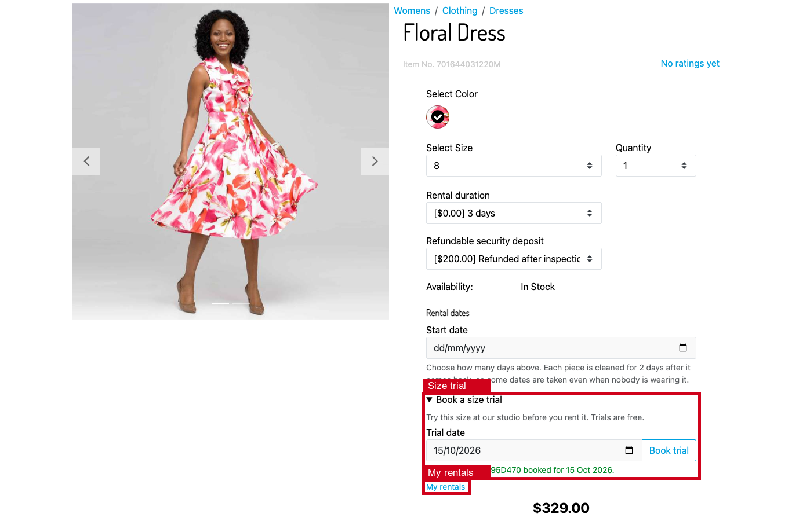
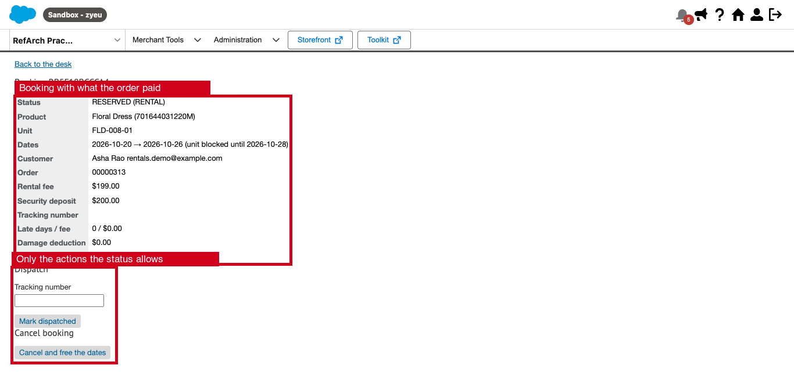
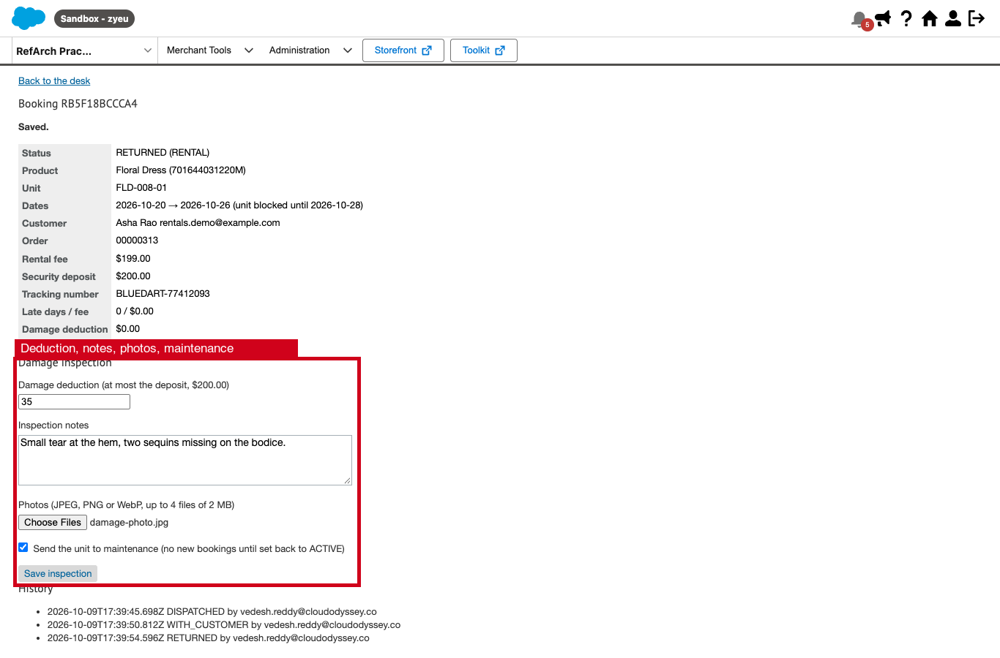

<div align="center">

# SFCC Rentals

### Rent pieces by the day: one calendar per physical unit, safe under concurrent checkout

Wedding lehengas, sherwanis and jewellery sets for 3, 5 or 7 days. Each unit gets cleaning days between rentals.
A refundable deposit is charged and a size trial can be booked. A Business Manager desk runs dispatch, returns, damage inspection and refunds.

[](https://github.com/Vedesh-reddy/sfcc-rentals/actions/workflows/ci.yml)


[Get started](docs/INSTALLATION.md) · [Merchant guide](docs/MERCHANT-GUIDE.md) · [Code reference](docs/CODE-REFERENCE.md) · [Architecture](docs/ARCHITECTURE.md) · [Phase PRs](docs/DEVELOPMENT-PHASES.md)

</div>


> Screenshots were captured on the author's sandbox (`zyeu-002`, site `RefArch_Practice`) on October 9, 2026. The demo uses the SFRA Floral Dress with four rental units.
> The orders are real SFCC orders. Red boxes mark what each feature adds.

## Why a reservation engine

SFCC inventory counts pieces. It cannot say that unit `LEH-RED-M-01` is out from 10 to 14 November and being cleaned on the 15th and 16th. This cartridge keeps that calendar in custom objects and leaves platform inventory alone.

Each blocked day of each unit is one `RentalUnitDay` object keyed `unit|yyyy-MM-dd`. A booking creates all of its days in one transaction. If two shoppers commit the same day at the same moment, the unique key makes the database reject the second claim, which rolls back completely. The engine then tries the next unit of the same size.

## What it does

| For shoppers | For merchants | For developers |
| --- | --- | --- |
| Pick a start date and see availability at once | Durations and deposit are native catalog options | One `plugin_rentals` overlay; no base file edited |
| Get the next free start date when dates are taken | One unit custom object per physical piece | Concurrency from a custom object unique key |
| Keep the piece held in the bag for 30 minutes | A Business Manager desk for the whole lifecycle | `module.superModule` wrappers for cart, checkout, models and login return |
| See the rental dates on the cart, checkout and order | Damage photos stored in IMPEX, shown inline | CSRF on every post, including the multipart inspection |
| Book a free size trial | Late fees and hold release run as jobs | Categorized logging (`rentals`) |
| Follow each booking to its deposit refund | Units can be sent to maintenance | 23 unit tests against a Script API double |

## Start in five steps

```sh
git clone https://github.com/Vedesh-reddy/sfcc-rentals.git
cd sfcc-rentals
npm ci
npm run validate
npm run package:metadata
```

1. **Build.** `npm run validate` runs the linters, the 23 unit tests and the asset build.
2. **Deploy.** Upload `cartridges/plugin_rentals` to your code version, including the generated `cartridge/static`.
3. **Activate.** Put `plugin_rentals` first on the storefront cartridge path, and add it to the Business Manager cartridge path.
4. **Import.** Rename `metadata/rentals/sites/RefArch` and the job `site-id` to your site, rebuild the ZIP and import `dist/rentals-metadata.zip`.
5. **Configure.** Add the two options to your rental products, create one unit per piece, grant the desk permission and schedule the two jobs.

```text
plugin_rentals:app_storefront_base
```

The [installation guide](docs/INSTALLATION.md) covers each step.

## Features

| # | Feature | Entry point | Data | Job |
| --- | --- | --- | --- | --- |
| 1 | [Rental dates on the product page](#1-rental-dates-on-the-product-page) | Product page | `RentalUnit`, `RentalUnitDay` | — |
| 2 | [Cart holds and concurrency](#2-cart-holds-and-concurrency) | Add to cart | `RentalBooking` (`HELD`) | `Rentals-ReleaseHolds` |
| 3 | [Price, deposit and tax](#3-price-deposit-and-tax) | Cart and checkout | Catalog options | — |
| 4 | [Order confirmation](#4-order-confirmation) | Place order | `RentalBooking` (`RESERVED`) | `Rentals-ReleaseHolds` |
| 5 | [Size trial](#5-size-trial) | Product page | `RentalBooking` (`TRIAL`) | — |
| 6 | [My rentals](#6-my-rentals) | `Rental-Bookings` | `RentalBooking` | — |
| 7 | [Rental desk](#7-rental-desk) | Business Manager | `RentalBooking` | — |
| 8 | [Damage inspection and deposit refund](#8-damage-inspection-and-deposit-refund) | Business Manager | `RentalBooking`, IMPEX files | — |
| 9 | [Late returns](#9-late-returns) | — | `RentalBooking`, `RentalUnitDay` | `Rentals-LateFees` |

---

### 1. Rental dates on the product page

**What it does.** The shopper chooses a duration and a start date. The panel answers at once with the return date, or with the next date a unit of that size is back and cleaned.


**How.**

- `product/components/productAvailability.isml` is an SFRA copy plus an uncached remote include, `Rental-Panel`, so the cached product page stays cached.
- The panel sits outside `.product-options`: SFRA re-renders that block from the variation response, where a remote include cannot run.
- `Rental-Quote` checks the dates against every active unit of the selected variant.

**Rules**

- A start date must be between `RentalLeadDays` (3) and `RentalHorizonDays` (180) days from today.
- Every rental blocks its own days plus `RentalBufferDays` (2) cleaning and return-transit days.
- Units in `MAINTENANCE` or `RETIRED` are never offered.

---

### 2. Cart holds and concurrency

**What it does.** Adding to the bag claims a unit at once and holds it for `RentalHoldMinutes` (30).



A second shopper who tries the same dates on the last unit is refused, even if their page still showed the dates as free:


**How.**

- `Cart-AddProduct` (prepend) claims the unit before the base route adds the line, using the posted duration option. The platform refuses to add and remove a line in the same request (`api.basket.addRemoveInSameRequest`), so a refused claim must stop the request before the line exists.
- `Cart-AddProduct` (append) attaches the hold to the new line.
- `Cart-RemoveProductLineItem` releases the hold.
- `Cart-UpdateQuantity` keeps a rental at one piece.
- `Cart-EditProductLineItem` refuses edits: to change dates, the shopper removes the line and adds it again.

**Rules**

- An expired hold no longer blocks anyone. The next claim deletes it in its own transaction, re-reading it first so a day another shopper has just claimed is never deleted. It then claims the day through the unique key as usual.
- `CheckoutServices-PlaceOrder` (prepend) renews every hold. It stops checkout if a line lost its days.
- One booking per piece per bag.

---

### 3. Price, deposit and tax

**What it does.** Pricing is native. The `rentalDuration` option holds a price per duration and `rentalDeposit` holds the deposit, so the product page, cart, promotions and order all handle them as usual. The deposit line is moved to the tax-exempt tax class, because a refundable deposit is not a sale.


On the sandbox order, tax is 5% of the $199 rental fee and $15.99 shipping. The $200 deposit is not taxed:


**How.** The `basketCalculationHelpers` wrapper sets the tax class before the base calculation. The `productLineItem` and `orderLineItem` model wrappers add the rental dates, which `cart/productCard/cartProductCardAvailability.isml` shows on the cart, checkout and order pages.

---

### 4. Order confirmation

**What it does.** When the order is placed, every hold in it becomes a reservation. The booking records the order, the customer, the rental fee and the deposit.

**How.** The `checkoutHelpers.placeOrder` wrapper clears the hold expiry on the booking and its days, then sets `RESERVED`. A failure there is logged and never fails the order.

**Rules.** If a hold ran out during payment and another shopper took a day, the booking is flagged *at risk* for the desk. `Rentals-ReleaseHolds` frees the days of bookings whose order is later cancelled or failed.

---

### 5. Size trial

**What it does.** A signed-in shopper books one studio day to try the size before renting. Trials are free and have no cleaning buffer.



**Rules.** A trial needs a login and a CSRF token. At most two trials can be active per shopper. Guests get a sign-in link that brings them back to My rentals (login return slot `6`).

---

### 6. My rentals

**What it does.** `Rental-Bookings` lists the shopper's rentals and trials with dates, status, deposit, deductions and the amount refunded.


---

### 7. Rental desk

**What it does.** *Merchant Tools → Rentals → Rental Desk* lists the work of the day:
- bookings to dispatch within 7 days
- size trials
- rentals out with customers, with overdue ones flagged
- returns awaiting inspection
- deposits to refund
- bookings at risk

Staff can also find any booking by booking or order number.


The booking page shows what the order paid, and only the actions its status allows:



| Action | From | To |
| --- | --- | --- |
| Dispatch (tracking number required) | `RESERVED` | `DISPATCHED` |
| Delivered | `DISPATCHED` | `WITH_CUSTOMER` |
| Return received (fixes the late fee) | `DISPATCHED`, `WITH_CUSTOMER` | `RETURNED` |
| Damage inspection | `RETURNED` | `INSPECTED` |
| Refund deposit (reference required) | `INSPECTED` | `DEPOSIT_REFUNDED` |
| Size trial done | `RESERVED` (trial) | `COMPLETED` |
| Cancel (frees the dates) | `HELD`, `RESERVED` | `CANCELLED` |

---

### 8. Damage inspection and deposit refund

**What it does.** The inspection records:
- a damage deduction of at most the deposit
- notes
- up to four photos (JPEG, PNG or WebP, 2 MB each)
- optionally, sending the unit to maintenance



The refund due is the deposit minus the damage deduction and the late fee. Staff refund it through their payment provider and record the reference. Every action is appended to the booking's history with the Business Manager user's name.


**How.**

- Photos are written to `IMPEX/src/rentals/<booking>/` under names generated by the server; the upload's own file name is never used.
- The desk shows the photos inline as data URIs, so they never need a public URL.
- The inspection form is multipart, so its CSRF token travels in the action URL.

---

### 9. Late returns

`Rentals-LateFees` (daily) handles every rental still out after its return date:

- it updates the running late fee: days late × `RentalLateFeePerDay`;
- it extends the unit's block until the piece can be back and cleaned;
- if the next customer has already booked those days, it flags that booking *at risk*, so the desk can swap in another unit.

The fee becomes final when the desk records the return. This path is covered by unit tests, not screenshots: no sandbox booking could end before the capture date.

---

## Documentation

| Guide | Contents |
| --- | --- |
| [Installation](docs/INSTALLATION.md) | Deploy, cartridge paths, metadata, catalog options, units, desk permission, jobs |
| [Merchant guide](docs/MERCHANT-GUIDE.md) | Preferences, products, units, the desk, jobs and custom objects |
| [Architecture](docs/ARCHITECTURE.md) | Request flows, booking states, data model, concurrency and security |
| [Code reference](docs/CODE-REFERENCE.md) | Every controller route, script module, template and job step |
| [Testing](docs/TESTING.md) | Automated checks and the sandbox checks behind the screenshots |
| [Troubleshooting](docs/TROUBLESHOOTING.md) | Symptoms, causes and fixes found on a real sandbox |
| [Development phases](docs/DEVELOPMENT-PHASES.md) | The five review PRs |

See [NOTICE.md](NOTICE.md) for attribution and terms.
